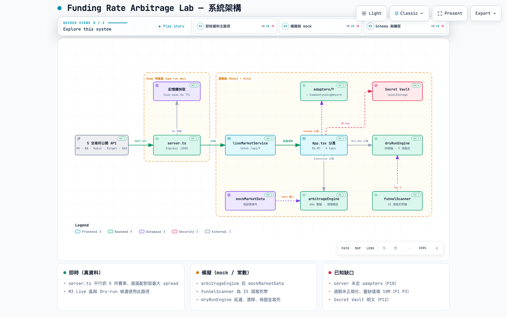
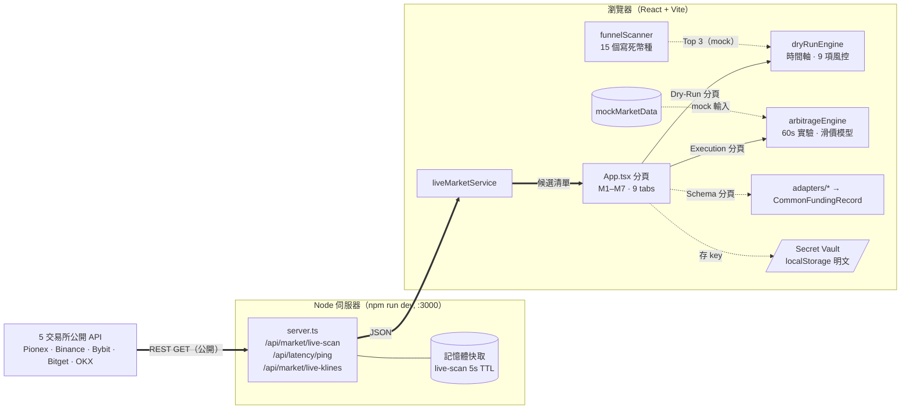

# ARCHITECTURE（架構速覽）

> 給人：打開 [`architecture.html`](architecture.html)（互動版，可搜尋、聚焦、切換 3 個導覽視角），或看下方截圖。
> 給 agent：讀本檔的 Mermaid 圖 + 元件索引即可；機器可解析版本在 [`architecture.json`](architecture.json)（含每個元件對應的原始碼路徑）。
> 基準 commit：`95535ca`。架構有變動時，三個檔案要一起更新（見文末）。



## 1. 圖（Mermaid）



圖例：粗線 `==>` = 即時真資料主路徑；虛線 `-.->` = mock / 僅展示 / 待改善。

## 2. 元件索引

| ID | 元件 | 原始碼 | 資料性質 | 說明 |
|----|------|-------|---------|------|
| exchanges | 5 交易所公開 API | `server.ts:68-117` | 即時 | 無需 API Key；各 6s timeout，失敗回空陣列 |
| server | Express 伺服器 | `server.ts:54-371` | 即時 | 自行解析各所 JSON → 以 base symbol 聚合 → 兩兩配對取最大 spread → 算預期淨利 |
| cache | 記憶體快取 | `server.ts:22-23` | — | 只快取 live-scan，5 秒 |
| svc | liveMarketService | `src/services/liveMarketService.ts` | — | 前端呼叫 3 個 `/api/*` |
| ui | App 分頁 | `src/App.tsx`、`src/components/*` | 混合 | 9 個分頁，見下表 |
| dryrun | dryRunEngine | `src/engine/dryRunEngine.ts` | 常數 | 延遲、價格漂移、保證金寫死；唯一失敗情境 = 單腿 429 |
| arb | arbitrageEngine | `src/engine/arbitrageEngine.ts` | 公式 | 60 秒執行實驗、滑價模型；輸入來自 mock |
| funnel | funnelScanner | `src/engine/funnelScanner.ts` | mock | 15 個寫死幣種的三級漏斗；提供 Dry-run 預設 Top 3 |
| mock | mockMarketData | `src/data/mockMarketData.ts` | mock | 假結算事件 + ±2m K 棒 |
| adapters | adapters/* | `src/adapters/*.ts`、`src/types/schema.ts` | 範例 | 原始 payload → `CommonFundingRecord`；**server 沒有使用** |
| secrets | Secret Vault | `src/components/LocalSecretsView.tsx:71` | — | 明文存 localStorage；目前無任何程式使用這些 key |

### 分頁 → 元件

| 分頁（Header） | 元件 | 用到 |
|---------------|------|------|
| M1. Common Schema & Adapters | `SchemaInspector` | adapters |
| M2. ±2m Kline & Volume Shock | `SettlementKlineViewer` | mock、`/api/market/live-klines` |
| M3. Multi-Ex Funnel Scanner | `FunnelScannerView` | `/api/market/live-scan`、`/api/latency/ping`、funnelScanner |
| M4. Arbitrage Scanner | `ArbitrageScanner` | mock → arbitrageEngine（`runAllBacktests`） |
| M4. Sensitivity Matrix | `SensitivityMatrix` | 純公式 |
| M5. 60s Execution Flow | `ExecutionSimulator` | mock → arbitrageEngine |
| M6/M7. Dry-Run & Risk Console | `DryRunConsole` | `/api/market/live-scan`、funnelScanner → dryRunEngine |
| Local Secret Vault | `LocalSecretsView` | localStorage |
| System Spec v0.2 | `SpecViewer` | `src/spec/arbitrageSpecV01.ts` |

## 3. 型別（兩套並存，見 HANDOFF P10）

- `src/types/schema.ts`：`CommonFundingRecord`、`SettlementWindowBar`、`ArbitrageTradeResult`（以 Pionex × Binance 兩腿為中心）
- `src/types/systemSpec.ts`：`FunnelCandidate`、`SimulatedOrderLeg`、`OrderState` / `PositionState`、`RiskStatusReport`、`LocalSecretsConfig`（5 所欄位平鋪）

## 4. 更新方式

架構改變時：

1. 改 `architecture.json`（元件 `sources` 要指向真實檔案，`meta.repository.revision` 改成新 commit 的完整 SHA）
2. 重新產生 HTML（需 archify skill）：
   ```bash
   node <archify>/bin/archify.mjs validate architecture assets/architecture.json --quality showcase --repo-root . --json
   node <archify>/bin/archify.mjs deliver  architecture assets/architecture.json assets/architecture.html --quality showcase --repo-root . --json
   ```
3. 同步更新本檔的 Mermaid 圖與索引表，並替換 `architecture.png`
